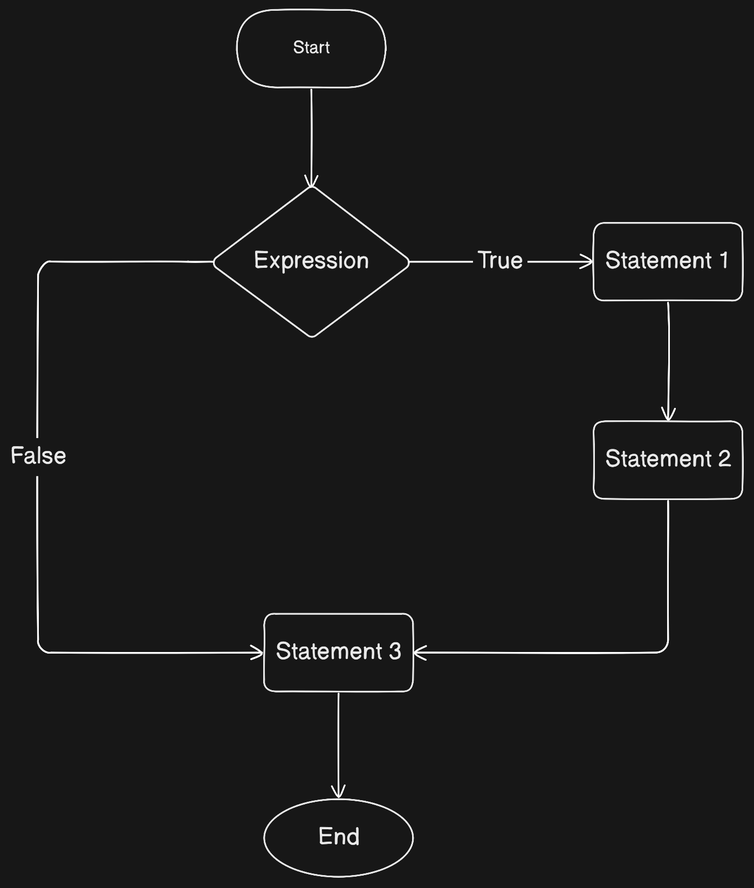
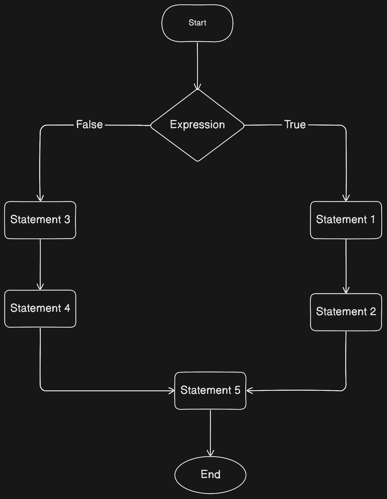

# Control Flow
- By default, code is executed sequentially from top to bottom
- However, such sequantial execution can only solve simple problems
- Control flow statements can be used to change the order of execution of code

## Types of Control Flow
- Conditional Statements
- Loops


## Conditional Statements
- if
- if-else
- if-elif-else
- match (after python 3.10)- Similar to switch in other languages


## Loops
- for
- while


## If Conditional Statements
- if statement is used to check if a condition is true or false
- if the condition is true, the code inside the if block is executed
- if the condition is false, the code inside the if block is skipped

### Syntax:
```python
if condition:
    # code to be executed if condition is true
```


### Flowchart:



### Example 1:
```python
if 5 > 3:
    print("5 is greater than 3")
```

### Example 2:
if customer has buyed a product and amount is greater than 1000, then give 10% discount.
```python
amount = 1200
discount = 0
if amount > 1000:
    discount = amount * 10 / 100

print("Discount: ", discount)
print("Amount to be paid: ", amount - discount)
```

## If-else Conditional Statements
- if-else statement is used to check if a condition is true or false
- if the condition is true, the code inside the if block is executed
- if the condition is false, the code inside the else block is executed

### Syntax:
```python
if condition:
    # code to be executed if condition is true
else:
    # code to be executed if condition is false
```

### Flowchart:


### Example 1:
```python
if 5 > 3:
    print("5 is greater than 3")
else:
    print("5 is not greater than 3")
```

### Example 2:
if customer has buyed a product and amount is greater than 1000, then give 10% discount, else give 5% discount.
```python
amount = 1200
discount = 0
if amount > 1000:
    discount = amount * 10 / 100
else:
    discount = amount * 5 / 100

print("Discount: ", discount)
print("Amount to be paid: ", amount - discount)
```


## If-elif-else Conditional Statements
- if-elif-else statement is used to check if a condition is true or false
- if the condition is true, the code inside the if block is executed
- if the condition is false, the code inside the elif block is executed
- if all the conditions are false, the code inside the else block is executed

### Syntax:
```python
if condition1:
    # code to be executed if condition1 is true
elif condition2:
    # code to be executed if condition2 is true
elif condition3:
    # code to be executed if condition3 is true
else:
    # code to be executed if all the conditions are false
```

### Example 1:
```python
marks = 80
if marks >= 90:
    print("Grade A")
elif marks >= 80:
    print("Grade B")
elif marks >= 70:
    print("Grade C")
elif marks >= 60:
    print("Grade D")
else:
    print("Grade F")
```

### Example 2:
if customer has buyed a product and amount is greater than 1000, then give 10% discount, if amount is greater than 500, then give 5% discount, else give 2% discount.
```python
amount = 1200
discount = 0
if amount > 1000:
    discount = amount * 10 / 100
elif amount > 500:
    discount = amount * 5 / 100
else:
    discount = amount * 2 / 100

print("Discount: ", discount)
print("Amount to be paid: ", amount - discount)
```

## Match Conditional Statements
- Match statement has been introduced in python 3.10
- It is similar to switch statement in other languages
- It is used to check if a value matches any of the given patterns
- If the value matches any of the given patterns, the code inside the corresponding block is executed
- If the value does not match any of the given patterns, the code inside default block is executed

### Syntax:
```python 
match variable:
   case pattern1:
        # code to be executed if value matches pattern1
   case pattern2:
        # code to be executed if value matches pattern2
    ...
    ...
    ...
   case patternN:
        # code to be executed if value matches patternN
    case _:
        # code to be executed if value does not match any of the patterns
```

### Example 1:
```python
marks = 80
match marks:
    case 90:
        print("Grade A")
    case 80:
        print("Grade B")
    case 70:
        print("Grade C")
    case 60:
        print("Grade D")
    case _:
        print("Grade F")
```

### Combined Cases:
```python
user = "admin"
match user:
    case "admin" | "superadmin":
        print("You have full access")
    case "user" | "guest":
        print("You have limited access")
    case _:
        print("You have no access")
```