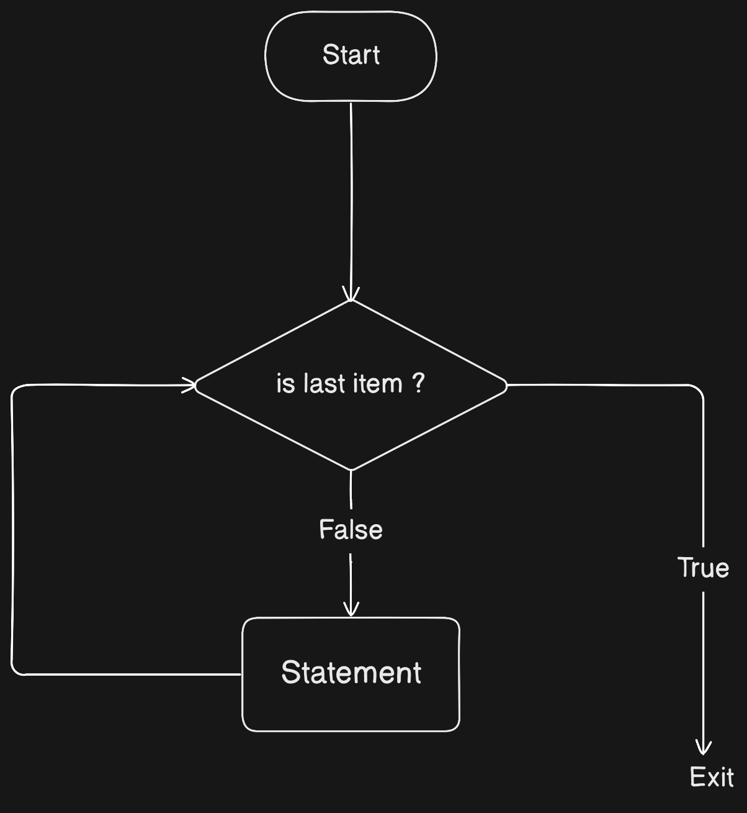
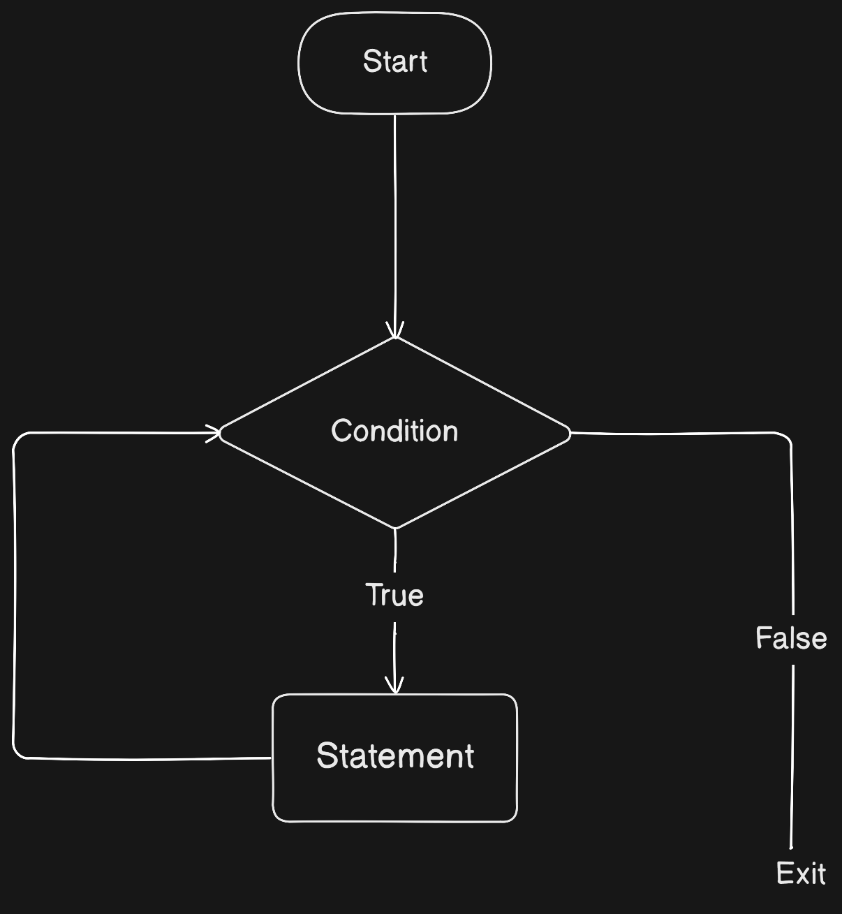

## For Loops
- for loop is used to iterate over a sequence such as list, tuple, set, dictionary, string, etc.

### Syntax:
```python
for item in sequence:
    # code to be executed for each item in sequence
```

### Flowchart:


### Example 1 (For loop with string):
```python
name = "John"
for char in name:
    print(char)
```

### Example 2 (For loop with list):
```python
marks = [90, 80, 70, 60, 50]
sum = 0
for mark in marks:
    sum += mark

print("Total marks: ", sum)
```

### Example 3 (For loop with tuple):
```python
marks = (90, 80, 70, 60, 50)
sum = 0
for mark in marks:
    sum += mark

print("Total marks: ", sum)
```

### Example 4 (For loop with set):
```python
marks = {90, 80, 70, 60, 50}
sum = 0
for mark in marks:
    sum += mark

print("Total marks: ", sum)
```

### Example 5 (For loop with dictionary):
```python
marks = {
    "Maths": 90,
    "Science": 80,
    "English": 70,
    "Hindi": 60,
    "Social Science": 50
    }
sum = 0
for subject in marks: # iterates over keys
    sum += marks[subject]

print("Total marks: ", sum)
```

### Example 6 (For loop with dictionary):
```python
marks = {
    "Maths": 90,
    "Science": 80,
    "English": 70,
    "Hindi": 60,
    "Social Science": 50
    }

print(marks.items()) # prints list of tuples

# prints key and value
for subject, mark in marks.items():
    print(subject, mark)


for item in marks:
    print(item) # prints key
```


## While Loops
- while loop is used to execute a block of code as long as a condition is true
- The condition is checked before executing the code inside the while loop
- If the condition is true, the code inside the while loop is executed

### Syntax:
```python
while condition:
    # code to be executed if condition is true
```

### Flowchart:


### Example 1:
```python
i = 1
while i <= 5:
    print(i)
    i += 1
```