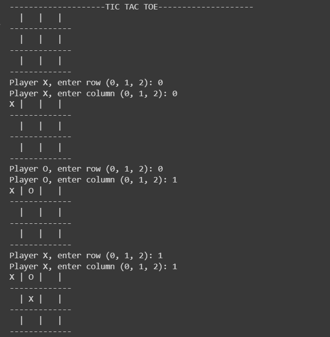
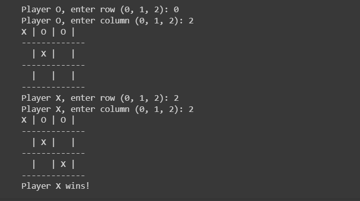

# Tic-Tac-Toe Game

## Overview
This is a console-based Tic-Tac-Toe game implemented in Python. Players take turns to make moves on a 3x3 grid, aiming to get three of their symbols in a row, column, or diagonal.

## Features
- 3x3 grid for gameplay.
- Two players (X and O) taking turns entering their moves by specifying the row and column (0, 1, 2).
- Checks for a winner after each move.
- Ends in a tie if the board is full.

##Screenshot

