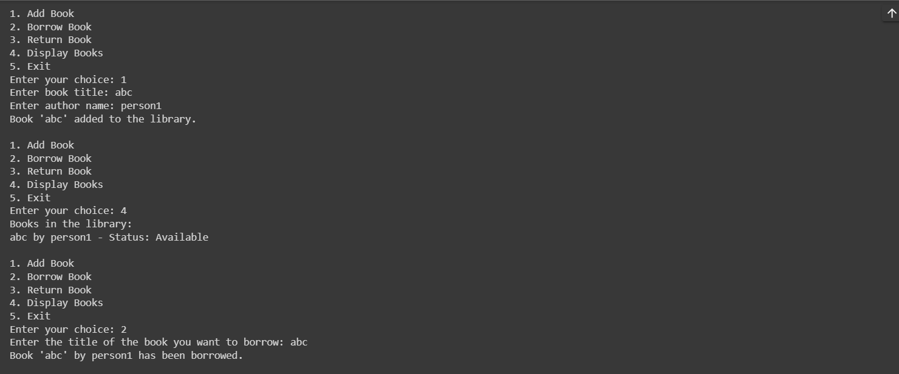
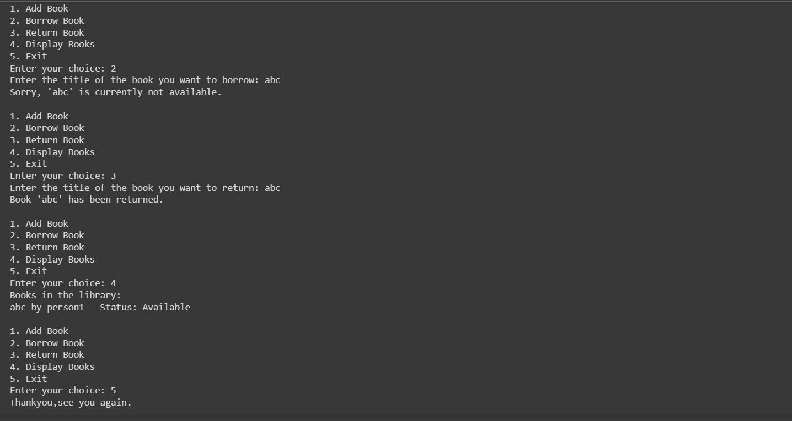

# Library Management System

This project is a simple library management system implemented in Python. It allows users to add books to the library, borrow and return books, and display the current list of books in the library.

[Note]: This is project to practice the fundamental oop in python we've learned so far ie: classes, object,access modifier

## Classes

### `Book`

The `Book` class represents a book in the library. It has the following attributes and methods:

- **Attributes:**
  -  Title of the book (private)
  -  Author of the book (private)
  -  Availability status of the book (private)

- **Methods:**
  - `get_title()`
  - `get_author()`
  - `is_available()`
  - `borrow()`
  - `return_book()`

- **Magic Method:**
  - `__str__()`

### `Library`

The `Library` class manages a collection of books. 

## Features

1. **Add Book**
   
2. **Borrow Book**
   
3. **Return Book**
   
4. **Display Books**
   
5. **Exit**
   
## Screenshot

