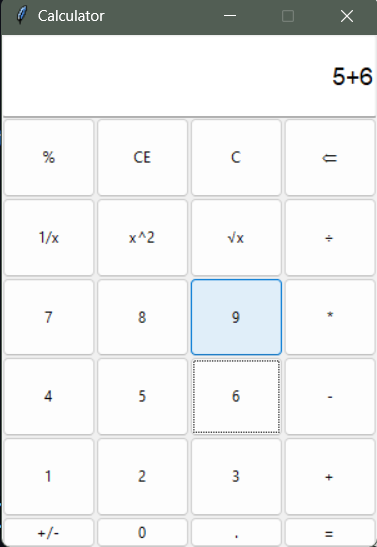

# Calculator App with Tkinter

This is a simple calculator application built using Python's Tkinter library.

## Features

- Arithmetic operations: Addition, Subtraction, Multiplication, Division
- Additional functions: Percentage, Square, Square Root, Inverse
- Backspace feature (⇐) to remove the last entered character
- Decimal point (.) for floating-point numbers

## Keyboard Event

- `Enter`: Calculate result ,you can pres enter instead of = button

### How Keyboard Events are Handled

we use a feature in Tkinter called the bind method to handle keyboard events. We use it to connect the 'Enter' key to a specific action in our calculator.
Example :

```python
self.root.bind('<Return>', lambda event: self.on_button_click('='))
```

This line of code means that when the user presses the 'Enter' key, it's like they clicked the '=' button on the calculator.

## Features

- **Tkinter Widgets**: Utilizes Tkinter's Entry and Button widgets for the user interface.
- **Event Handling**: Responds to button clicks and keyboard events, such as the 'Enter' key.
- **Grid Layout**: Configures rows and columns for proper grid-based layout, enhancing the responsiveness of the calculator.

## Screenshots


