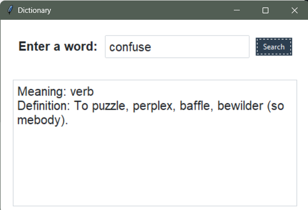

#Dictionary App

The Dictionary App is a simple desktop application built using Python and the Tkinter library.

##Features

- Search for Definitions: Enter a word in the input field and click the "Search" button to fetch its definitions from an external API.

- Display Meanings: The app displays the meanings of the entered word, including the part of speech and definition.

##Dependencies
Tkinter: Used for creating the graphical user interface.

ttkbootstrap: Provides additional styles for Tkinter widgets, it is similar to the bootstrap used for styling HTML.

Requests: Used to make HTTP requests to the external dictionary API.

#Acknowledgments
The app uses the [Dictionary API](https://dictionaryapi.dev/) to fetch word definitions.

<!-- screenshot -->

#Screen Shot

