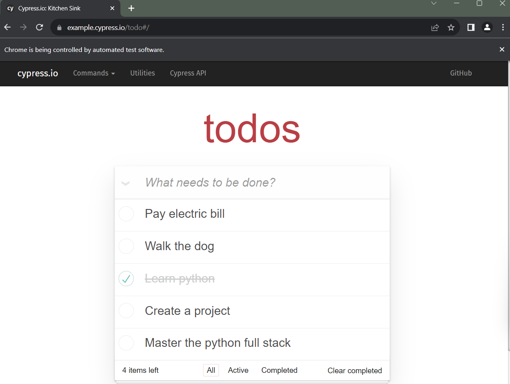

# Selenium Todo List Automation

This Selenium script automates the actions on a Todo list application found at https://example.cypress.io/todo#/completed. The script adds new todos, marks them as completed, and then clears the completed todos.

## Explanation

- The script uses Selenium WebDriver to automate actions on the Todo list application.
- It opens the application in a Chrome browser.
- Waits for 1 second to ensure the page is loaded.
- Adds new todos "Learn python", "Create a project", and "Master the python full stack".
- Marks the third, fourth, and fifth todos as completed.
- Clears the completed todos.
- Handles exceptions and closes the browser afterward.

## Methods Used

- `webdriver.Chrome()`: Initializes a Chrome WebDriver instance.
- `driver.get(url)`: Navigates to the specified URL.
- `time.sleep(seconds)`: Pauses execution for the specified number of seconds.
- `find_element(By.CLASS_NAME, class_name)`: Finds the first element matching the specified class name.
- `find_elements(By.CLASS_NAME, class_name)`: Finds all elements matching the specified class name.
- `find_element(By.XPATH, xpath)`: Finds the first element matching the specified XPath expression.
- `element.click()`: Simulates a mouse click on the element.
- `ActionChains(driver)`: Instantiates an ActionChains object for performing keyboard and mouse actions.
- `send_keys(keys)`: Sends keys to the current focused element.
- `key_down(Keys.ENTER)`: Sends an Enter key press event.
- `quit()`: Closes the browser and terminates the WebDriver session.

## References

- Selenium WebDriver Documentation: [https://www.selenium.dev/documentation/en/](https://www.selenium.dev/documentation/en/)

### Todo List Application

- Original source: [Cypress Example TodoMVC](https://example.cypress.io/)

## Screenshots

